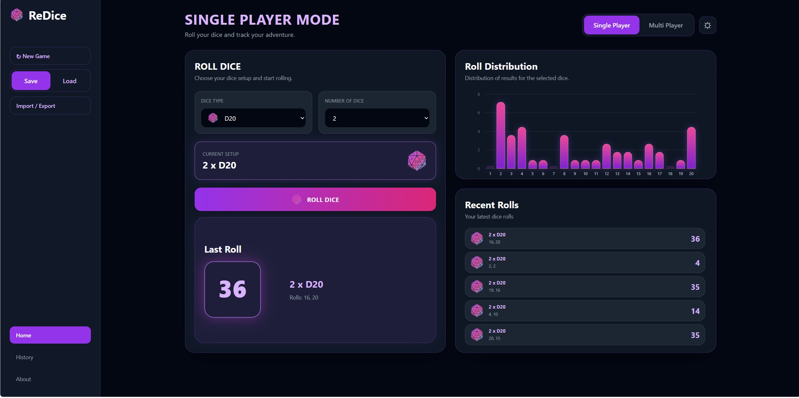
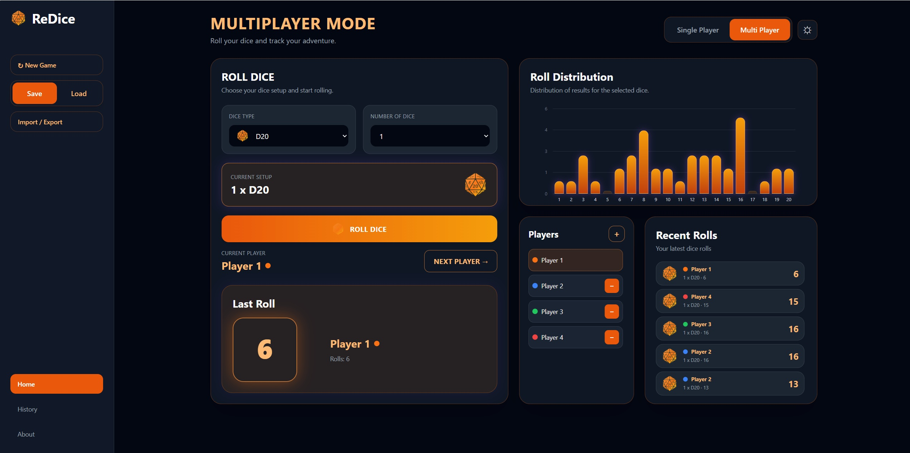

# ReDice

ReDice is a responsive RPG dice roller web application built with F# and WebSharper as a single page application project.

The application supports both Single Player and local Multiplayer modes, allowing users to roll multiple RPG dice types, manage players, track roll history, and analyze roll distributions through interactive statistics.

## Live Demo

https://reaimx.github.io/ReDice/

## Main Features

* Single Player mode
* Local Multiplayer mode
* Dice support from D4 to D100
* Editable player management
* Roll history tracking
* Roll distribution statistics
* Save / Load system using LocalStorage
* Import / Export support with `.redice` save files
* Responsive desktop and mobile layout
* Dark and light theme support
* History analytics and summaries
* About page with project information

## Technologies Used

* F#
* WebSharper
* WebSharper.UI
* Tailwind CSS
* HTML5
* CSS3

## How to Run Locally

Clone the repository:

```bash
git clone https://github.com/reaimx/ReDice.git
```

Open the project folder:

```bash
cd ReDice
```

Run the application:

```bash
dotnet run
```

The application will start on a local development server.

## Screenshots

### Single Player Mode



### Multiplayer Mode



## Project Goal

The goal of ReDice is to provide a modern and responsive RPG dice roller application with local multiplayer support, roll tracking, statistics, and portable save functionality while following the technologies and concepts introduced in the DUE Functional F / WebSharper SPA course material.

## Repository

https://github.com/reaimx/ReDice
